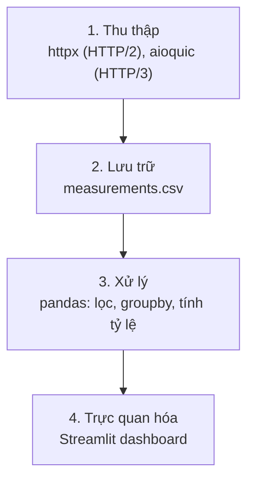
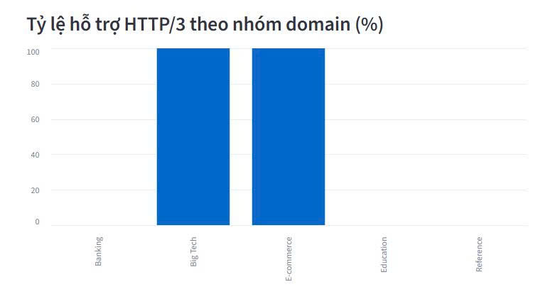
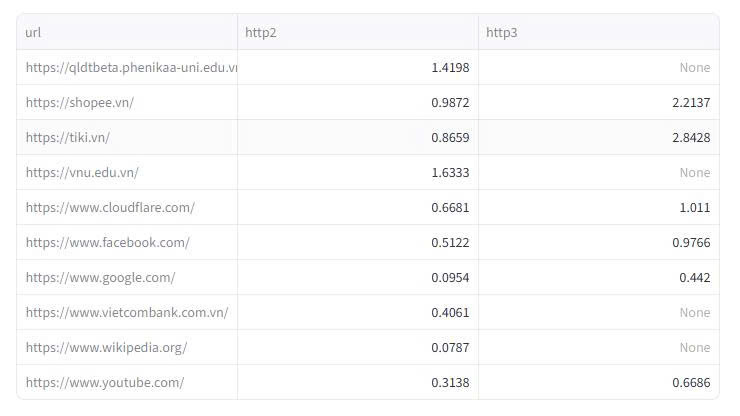

# QUIC vs TCP Measurement — So sánh hiệu năng HTTP/3 và HTTP/2 trên mạng Việt Nam

Pipeline tự động đo lường, lưu trữ và trực quan hóa mức độ hỗ trợ HTTP/3 (QUIC)
so với HTTP/2 trên các nhóm website phổ biến tại Việt Nam, chạy tự động mỗi giờ
qua GitHub Actions.

## Vấn đề nghiên cứu

QUIC (nền tảng của HTTP/3) được kỳ vọng cải thiện tốc độ và độ ổn định so với
TCP/HTTP2, nhưng mức độ áp dụng thực tế phụ thuộc nhiều vào hạ tầng từng khu
vực. Dự án này đo lường: **domain nào tại Việt Nam đã hỗ trợ HTTP/3, và mức độ
hỗ trợ khác nhau ra sao giữa các lĩnh vực (Big Tech, ngân hàng, thương mại
điện tử, giáo dục)?**

## Kiến trúc pipeline



Toàn bộ pipeline chạy tự động mỗi giờ qua GitHub Actions — không cần server
riêng, dữ liệu được commit trở lại repo sau mỗi lần chạy.

## Kết quả trực quan





## Kết quả chính

Sau 1608 lần đo trên 12 domain thuộc 5 nhóm:

- **Big Tech (Google, Cloudflare, Facebook, YouTube)**: 100% hỗ trợ HTTP/3.
- **Thương mại điện tử (Shopee, Tiki)**: 100% hỗ trợ HTTP/3.
- **Ngân hàng (MB Bank, Vietcombank)**: 0% hỗ trợ HTTP/3.
- **Giáo dục (VNU, Phenikaa)**: 0% hỗ trợ HTTP/3.
- Ngoại lệ đáng chú ý: **Wikipedia** không hỗ trợ HTTP/3 dù là nền tảng lớn.

→ Ngân hàng và giáo dục tại Việt Nam ưu tiên ổn định hơn tốc độ, chưa áp dụng
giao thức truyền tải mới; các nền tảng thương mại điện tử lớn đã bắt kịp
chuẩn quốc tế.

## Hạn chế của phương pháp đo lường

Do `curl` mặc định không hỗ trợ HTTP/3, dự án dùng `httpx` cho HTTP/2 (gọi
trực tiếp) và `aioquic` cho HTTP/3 (gọi qua tiến trình con). Vì vậy giá trị
thời gian phản hồi của HTTP/3 bao gồm thêm overhead khởi động tiến trình,
không phản ánh thuần túy tốc độ giao thức. Dữ liệu về **tỷ lệ hỗ trợ**
(success/failed/timeout) không bị ảnh hưởng bởi vấn đề này và đáng tin cậy.

## Cách chạy

```bash
pip install httpx[http2] aioquic wsproto streamlit pandas
python3 collect.py        # thu thập 1 lần
python3 phan_tich_dulieu.py   # xử lý dữ liệu
streamlit run dashboard.py    # xem dashboard
```

Lịch chạy tự động được cấu hình tại `.github/workflows/measure.yml`.

## Công nghệ sử dụng

Python, httpx, aioquic, pandas, Streamlit, GitHub Actions, Git.
